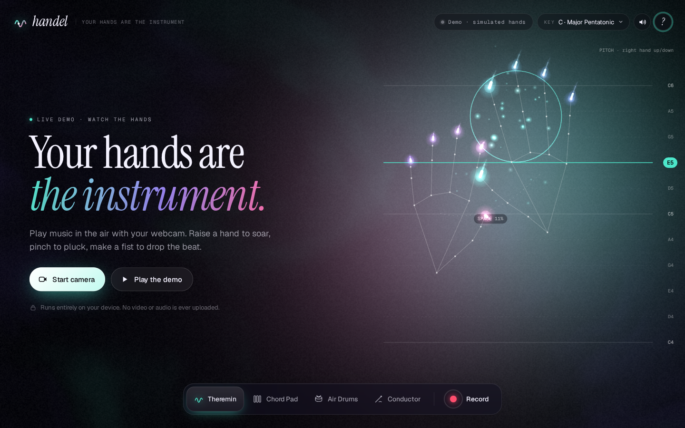
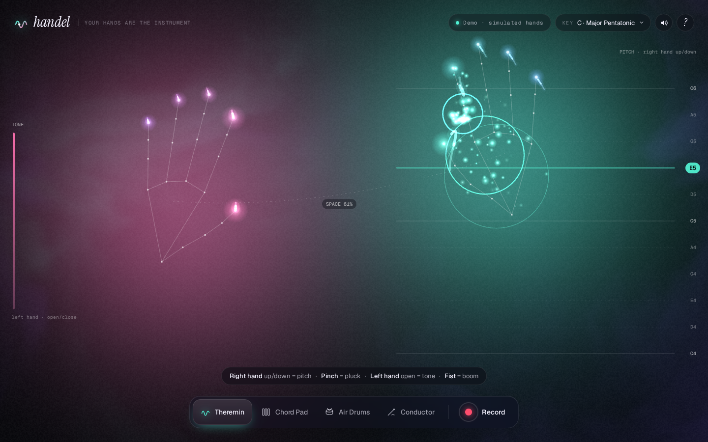
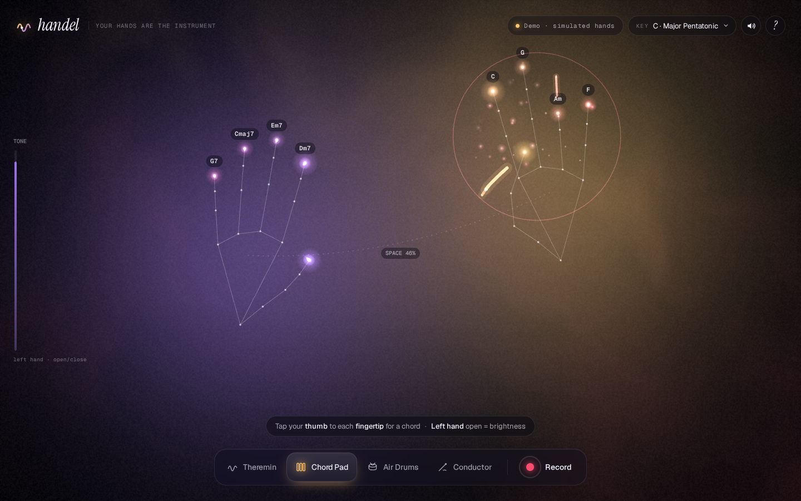
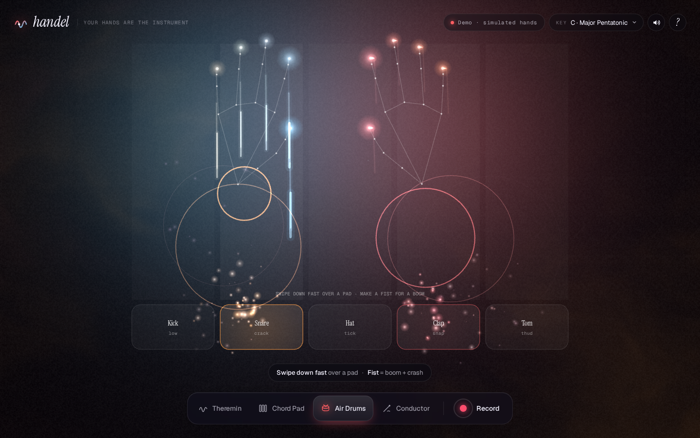
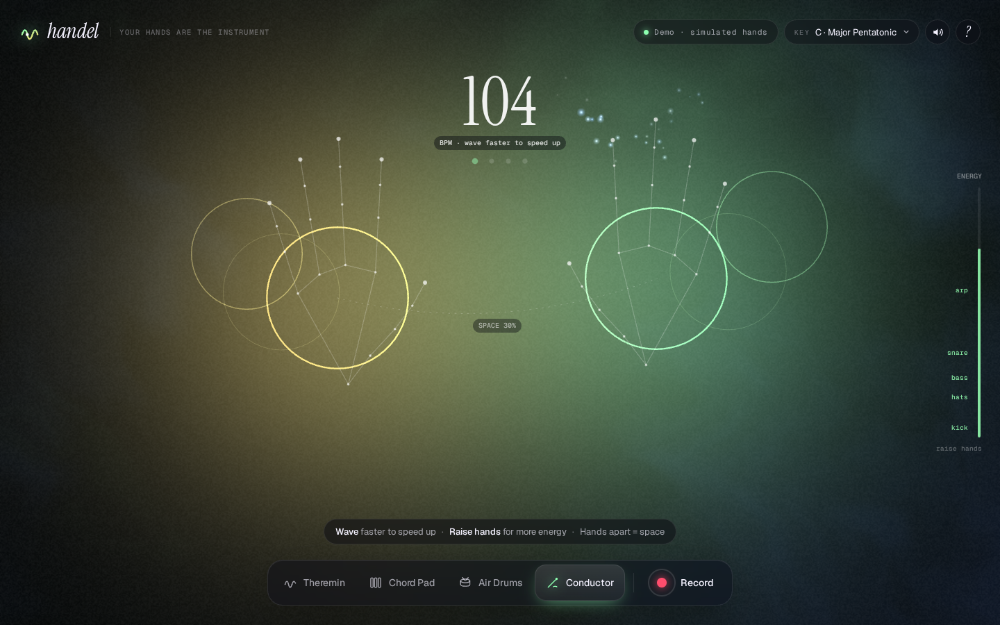

# Handel — your hands are the instrument

Play music in the air with your webcam. Raise a hand to soar, pinch to pluck, make a fist to drop the beat. One screen, zero installs, nothing uploaded.

**Live demo → https://chris-wozniczek.github.io/handel/**



| Theremin | Chord Pad | Air Drums | Conductor |
|---|---|---|---|
|  |  |  |  |

## How to use

1. Open the page — a live demo is already playing with simulated hands.
2. Hit **Start camera** (or **Play the demo** to hear it without a webcam).
3. Pick a mode in the dock, pick a key/scale top-right, and play:

| Move | What it does |
|---|---|
| **Right hand up/down** | Pitch, snapped to the chosen scale (it always sounds good) |
| **Pinch** (thumb + index) | Pluck a bell note |
| **Left hand open/close** | Filter + volume |
| **Fist** | Drum hit (boom + crash) |
| **Hands apart** | Bigger reverb space |

Modes:
- **Theremin** — glide a warm lead, pluck melodies with pinches. On-screen note guides show where each scale note sits.
- **Chord Pad** — tap your thumb to each fingertip; every finger is a diatonic chord in your key.
- **Air Drums** — swipe down fast over a pad (kick, snare, hat, clap, tom).
- **Conductor** — a looping band follows you: wave faster to speed up the tempo, raise hands for more layers.

Hit **Record** for a 15-second clip (visuals + audio) and download it as MP4/WebM to post to X.
Keyboard: `1–4` modes, `R` record, `C` camera, `M` mute, `?` help.

## How it works

- **Tracking:** [MediaPipe Tasks Vision](https://ai.google.dev/edge/mediapipe/solutions/vision/hand_landmarker) `HandLandmarker` (WASM + float16 model from public CDNs), two hands, GPU delegate with CPU fallback, throttled to ~30 fps. Landmarks are smoothed per hand and turned into features: openness, pinch ratio, fist, fingertip touches, palm velocity.
- **Gestures → music:** a small gesture layer emits events (`pinch`, `touch`, `fist`, `strike`) with hysteresis and cooldowns; continuous features drive pitch, filter, reverb crossfade and tempo.
- **Sound:** [Tone.js](https://tonejs.github.io/) — detuned saw lead + sub through a low-pass, FM bell pluck, poly pad, synthesized drums, a transport-driven loop for Conductor, all through delay, two reverbs (crossfaded by hand distance), a compressor and a limiter. No samples, no harsh beeps.
- **Visuals:** a WebGL fragment shader (fbm noise, audio-reactive glow, duotone + edge-glow stylized mirrored webcam, grain, vignette) under a 2D canvas layer with fingertip ribbons, particles, note rings and guides.
- **Recording:** `canvas.captureStream(30)` + a `MediaStreamAudioDestinationNode` → `MediaRecorder`. The clip is a local Blob URL.
- **Demo mode:** procedurally animated synthetic hands feed the exact same pipeline, so the page is alive before any permission prompt.
- No build step, no framework: plain ES modules, HTML and CSS.

## Privacy

Runs entirely on your device. The camera feed is processed in your browser tab; no video, audio or landmarks are ever sent anywhere. The only network requests are for static files (the page, fonts, Tone.js, the MediaPipe WASM and model).

## Run locally

```bash
git clone https://github.com/chris-wozniczek/handel.git
cd handel
python3 -m http.server 8080   # any static server works
# open http://localhost:8080 (camera needs localhost or https)
```

Fork it and GitHub Pages deploys it for you (`.github/workflows/pages.yml`).

## Built for Hackyard Yard #3 — One Screen

Built for [Hackyard Yard #3](https://hackyard.tech/yards/yard-3), theme **One Screen**: everything happens on a single view (overlays and modals only, no routes or pages). All code was written from scratch during the build week (Sep 21–25, 2026) by [Devin](https://devin.ai) (Cognition's AI software engineer) for Krzysztof Woźniczek.

## License

[MIT](LICENSE)
